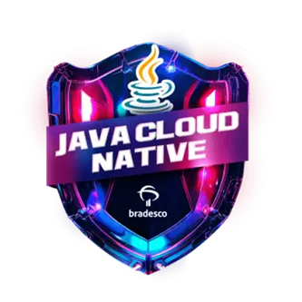

<pre style="font-size: 0.6rem;">

                              \\\\\\
                           \\\\\\\\\\\\
                          \\\\\\\\\\\\\\\
-------------,-|           |C>   // )\\\\|    .o88b. db   db  .d8b.  db    db  .d8b.  d888888b d888888b d88888b
           ,','|          /    || ,'/////|   d8P  Y8 88   88 d8' '8b 88    88 d8' '8b '~~88~~' '~~88~~' 88'  
---------,','  |         (,    ||   /////    8P      88ooo88 88ooo88 Y8    8P 88ooo88    88       88    88ooooo 
         ||    |          \\  ||||//''''|    8b      88~~~88 88~~~88 '8b  d8' 88~~~88    88       88    88~~~~~ 
         ||    |           |||||||     _|    Y8b  d8 88   88 88   88  '8bd8'  88   88    88       88    88.   
         ||    |______      ''''\____/ \      'Y88P' YP   YP YP   YP    YP    YP   YP    YP       YP    Y88888P
         ||    |     ,|         _/_____/ \
         ||  ,'    ,' |        /          |                 ___________________________________________
         ||,'    ,'   |       |         \  |              / \                                           \ 
_________|/    ,'     |      /           | |             |  |                                            | 
_____________,'      ,',_____|      |    | |              \ |      chavatte@duck.com                     | 
             |     ,','      |      |    | |                |                        chavatte.42web.io   | 
             |   ,','    ____|_____/    /  |                |    ________________________________________|___
             | ,','  __/ |             /   |                |  /                                            /
_____________|','   ///_/-------------/   |                 \_/____________________________________________/ 
              |===========,'                                                                                
			  

</pre>

# **Bootcamp Bradesco - Java Cloud Native**

Este repositório contém os projetos desenvolvidos durante o **Bootcamp Bradesco - Java Cloud Native**.
Aqui você encontrará desde os fundamentos da linguagem Java até a criação de APIs robustas com Spring Framework, explorando também conceitos de Cloud Computing com a plataforma Azure.

## Objetivo

Desenvolver as habilidades essenciais para construir aplicações back-end escaláveis, seguras e eficientes, utilizando as melhores práticas do mercado com Java, Spring Boot e ferramentas de Cloud Computing como o Azure.

## Conteúdo Programático

* **Princípios de Desenvolvimento de Software Colaborativo:** Colaboração, Git, metodologias ágeis.
* **Dominando a Linguagem de Programação Java:** Sintaxe, estruturas de dados, algoritmos.
* **Programação Orientada a Objetos com Java:** Classes, objetos, herança, polimorfismo.
* **Testes e Gerenciamento de Dependências em Projetos Java:** JUnit, Maven, Gradle.
* **Banco de Dados SQL e NoSQL Para Desenvolvedores Back-end:** Modelagem, consultas, PostgreSQL, MongoDB.
* **Ganhando Produtividade com Spring Framework e Java:** Spring Boot, REST APIs, injeção de dependências.
* **Cloud Computing com Azure:** Introdução aos serviços de Cloud, Máquinas Virtuais, Bancos de Dados na Nuvem, IA e ferramentas de desenvolvimento.

## **Projetos**

* **LAB-01: Simulador de Conta Bancária em Java Através Do Terminal/Console:** Introdução à linguagem Java e conceitos básicos de programação. [Link para o projeto](./projects/LAB-01/README.md)
* **LAB-02: Controle de Fluxo:** Prática de estruturas de controle de fluxo em Java. [Link para o projeto](./projects/LAB-02/README.md)
* **LAB-03: Modelando o iPhone com UML:** Introdução a modelagem de sistemas com UML. [Link para o projeto](./projects/LAB-03/README.md)
* **LAB-04: Criando um Banco Digital com Java e Orientação a Objetos:** Aplicação de conceitos de POO em um projeto prático. [Link para o projeto](./projects/LAB-04/README.md)
* **LAB-05: Criando um Jogo do Sudoku em Java:** Desenvolvimento de um jogo para consolidar conhecimentos de Java. [Link para o projeto](./projects/LAB-05/Sudoku/README.md)
* **LAB-06: Design Patterns com Java: Dos Clássicos (GoF) ao Spring Framework:** Estudo e aplicação de padrões de projeto em Java. [Link para o projeto](./projects/LAB-06/hotelReservation/README.md)
* **LAB-07: API REST na Nuvem Usando Spring Boot 3, Java 17 e Fly.io:** Criação e deploy de API REST utilizando Spring Boot. [Link para o projeto](./projects/LAB-07/biblioteca/README.md)
* **LAB-08: Criando Board de Tarefas com Java:** Desenvolvimento de um sistema para gerenciamento de tarefas. [Link para o projeto](./projects/LAB-08/chavatteboard/README.md)
* **LAB-09: Microsoft Azure - Localizando Serviços por Categoria:** Introdução à plataforma Azure e seus serviços. [Link para o projeto](./projects/LAB-09/README.md)
* **LAB-10: Criando máquinas Virtuais na Azure:** Prática de criação e configuração de VMs na Azure. [Link para o projeto](./projects/LAB-10/README.md)
* **LAB-11: Configurando uma instância de Banco de Dados na Azure:** Configuração de um banco de dados na nuvem Azure. [Link para o projeto](./projects/LAB-11/README.md)
* **LAB-12: Construindo Arquiteturas no Azure:** Desenvolvimento de arquiteturas de sistemas na plataforma Azure. [Link para o projeto](./projects/LAB-12/README.md)
* **LAB-13: Configurando Recursos e Dimensionamentos em Máquinas Virtuais na Azure:** Otimização de recursos em VMs na Azure. [Link para o projeto](./projects/LAB-13/README.md)
* **LAB-14: Análise de Sentimentos com Language Studio no Azure AI:** Introdução ao uso de IA na Azure para análise de sentimentos. [Link para o projeto](./projects/LAB-14/README.md)
* **LAB-15: Azure Cognitive Search: Utilizando AI Search para indexação e consulta de Dados:** Implementação de indexação e busca de dados com Azure Cognitive Search. [Link para o projeto](./projects/LAB-15/README.md)
* **LAB-16: Explorando os Recursos de IA Generativa com Copilot e OpenAI:** Exploração de ferramentas de IA generativa com Copilot e OpenAI na Azure. [Link para o projeto](./projects/LAB-16/README.md)

## Certificado de conclusão

 🎓 [Java Cloud Native]()
