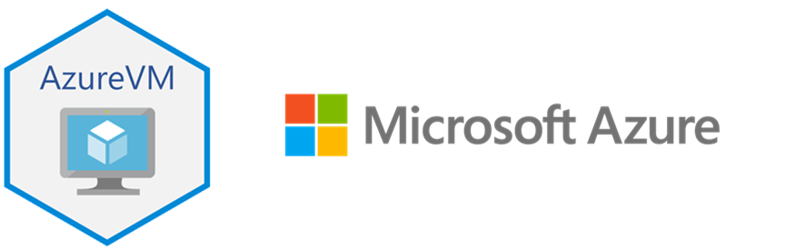

# LAB-10: Microsoft Azure - Criando Máquinas Virtuais

## Guia detalhado para criação de VMs no Azure

### Descrição

Este projeto detalha o processo de criação de máquinas virtuais (VMs) no Microsoft Azure, um passo fundamental para a implantação de aplicações e serviços em nuvem. Abordaremos desde a configuração inicial do ambiente até a implantação e gerenciamento da VM, fornecendo um guia passo a passo para profissionais de TI e entusiastas da computação em nuvem.

### Conceitos Fundamentais

Antes de iniciar o processo de criação, é crucial compreender alguns conceitos chave do Azure:

* **SLA (Service Level Agreement):** O SLA define o compromisso da Microsoft com a disponibilidade e desempenho dos serviços Azure. É importante escolher as configurações de VM adequadas para atender aos requisitos de SLA da sua aplicação. A tabela abaixo resume os níveis de SLA e seus respectivos tempos de inatividade:

    | SLA       | Tempo de inatividade por semana | Tempo de inatividade por mês |
    | :-------- | :------------------------------ | :----------------------------- |
    | 99%       | 1,68 hora                      | 7,2 horas                     |
    | 99,9%     | 10,1 minutos                   | 43,2 minutos                  |
    | 99,95%    | 5 minutos                      | 21,6 minutos                  |
    | 99,99%    | 1,01 minuto                    | 4,32 minutos                  |

* **Zonas de Disponibilidade:** Locais físicos distintos dentro de uma região do Azure, que oferecem redundância e proteção contra falhas de datacenter. Recomenda-se o uso de VMs em zonas de disponibilidade para aumentar a resiliência da aplicação.
* **Redundância de Armazenamento:** O Azure oferece diferentes opções de redundância de armazenamento (LRS, ZRS, GRS, GZRS) para proteger os dados contra falhas de hardware e desastres regionais. A escolha da redundância adequada depende dos requisitos de disponibilidade e durabilidade dos dados.

### Acessando o Portal do Azure

O primeiro passo é acessar o portal do Azure em [https://portal.azure.com](https://portal.azure.com) e fazer login com suas credenciais. Para novos usuários, é possível criar uma conta gratuita para explorar os serviços básicos do Azure.

### Criando uma Máquina Virtual

O processo de criação de uma VM no Azure envolve os seguintes passos:

1.  **Acessar a Seção de Máquinas Virtuais:**
    * No painel de navegação à esquerda, clique em "Todos os Serviços" e procure por "Máquinas Virtuais".
    * Selecione a opção "Máquinas Virtuais" em "Computação" e clique em "Adicionar" ou "Criar".
2.  **Configurações Básicas:**
    * Selecione a assinatura e o grupo de recursos desejados.
    * Insira o nome da VM e escolha a região onde ela será hospedada.
    * Selecione a imagem do sistema operacional (Windows Server, Ubuntu, etc.) e o tipo de autenticação (senha ou chave SSH).
3.  **Tamanho da Máquina Virtual:**
    * Escolha o tamanho da VM com base nos requisitos de CPU, memória e armazenamento da sua aplicação.
4.  **Configurações de Disco:**
    * Selecione o tipo de disco do sistema operacional (SSD, HDD) e adicione discos adicionais, se necessário.
5.  **Configurações de Rede:**
    * Escolha a rede virtual e sub-rede desejadas.
    * Defina se a VM terá um endereço IP público.
    * Configure as regras do Grupo de Segurança de Rede (NSG) para permitir o acesso via RDP ou SSH.
6.  **Revisão e Criação:**
    * Revise todas as configurações e clique em "Revisar + criar" e, em seguida, em "Criar".

### Gerenciando a Máquina Virtual

Após a criação, é possível acessar a VM via RDP ou SSH e gerenciar suas configurações no portal do Azure. Recomenda-se monitorar o desempenho da VM e ajustar as configurações conforme necessário.

### Considerações sobre disponibilidade e redundância

Para garantir alta disponibilidade, considere as seguintes práticas:

* Implementar zonas de disponibilidade para proteger contra falhas de datacenter.
* Utilizar conjuntos de disponibilidade para distribuir VMs em diferentes domínios de falha.
* Configurar o balanceamento de carga para distribuir o tráfego entre várias VMs.
* Escolher as configurações de redundância de armazenamento de acordo com a necessidade da aplicação.

### Conclusão

A criação de VMs no Azure é um processo flexível e personalizável, que permite a implantação de aplicações em nuvem de forma rápida e eficiente. Ao seguir as melhores práticas e considerar os conceitos de disponibilidade e redundância, é possível garantir o desempenho e a confiabilidade das aplicações em ambiente Azure.

### Recursos Adicionais

* **Portal do Microsoft Azure**: [https://azure.microsoft.com/](https://azure.microsoft.com/)
* **Documentação do Azure**: [https://learn.microsoft.com/pt-br/azure/](https://learn.microsoft.com/pt-br/azure/)