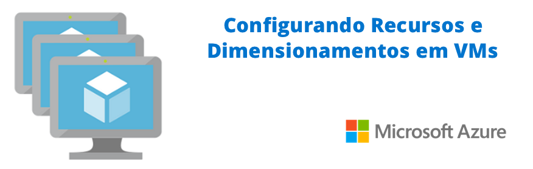

# LAB-13: Microsoft Azure - Configurando Recursos e Dimensionamentos em Máquinas Virtuais na Azure

## Um Guia para Otimização e Escalabilidade

### Descrição

Este projeto detalha o processo de configuração de recursos e dimensionamento de Máquinas Virtuais (VMs) na Microsoft Azure. Exploramos desde a criação de VMs individuais até a implementação de conjuntos de dimensionamento (VMSS) e balanceamento de carga, garantindo alta disponibilidade e desempenho para suas aplicações.

### Conceitos Fundamentais

Antes de explorarmos a configuração de VMs na Azure, é essencial entender alguns conceitos fundamentais:

* **Virtualização na Nuvem:** VMs do Azure são computadores virtuais que operam em servidores físicos na infraestrutura global da Microsoft.
* **Escalabilidade e Flexibilidade:** A Azure permite dimensionar recursos de computação de acordo com as demandas de aplicativos.
* **Alta Disponibilidade e Desempenho:** Implementação de VMSS e balanceamento de carga para garantir a continuidade dos serviços.

### Componentes e Configurações de Máquinas Virtuais na Azure

#### Criação e Gerenciamento de VMs Individuais

O processo de criação de VMs na Azure pode ser realizado através do portal do Azure, simplificando a configuração de recursos.

##### Passos para Criação de uma VM Windows no Portal do Azure:

1.  Acessar o portal do Azure e pesquisar por "Máquinas virtuais".
2.  Selecionar "Criar" e, em seguida, "Máquina virtual do Azure".
3.  Definir as configurações básicas:
    * **Nome da VM**: Identificador único da máquina virtual.
    * **Região**: Localização geográfica do data center da Azure onde a VM será hospedada.
    * **Imagem**: Sistema operacional da VM (e.g., Windows Server 2022, Ubuntu Linux).
    * **Tamanho**: Especificações de hardware da VM (CPU, memória, armazenamento).
4.  Configurar a conta de administrador:
    * **Nome de usuário e senha**: Credenciais para acesso à VM.
5.  Definir regras de porta de entrada:
    * Permitir tráfego para portas essenciais (e.g., RDP 3389, HTTP 80).
6.  Revisar e criar a VM.

##### Conexão e Configuração da VM:

* Após a criação, conectar-se à VM via RDP (para Windows) ou SSH (para Linux).
* Instalar os softwares e serviços necessários.
* Configurar o firewall e aplicar patches de segurança.

#### Conjuntos de Dimensionamento de Máquinas Virtuais (VMSS)

Para aplicações que exigem alta escalabilidade, os VMSS permitem implantar e gerenciar um conjunto de VMs idênticas como um grupo.

##### Vantagens dos VMSS:

* **Escalabilidade automática:** Ajuste dinâmico do número de VMs com base na demanda.
* **Alta disponibilidade:** Distribuição do tráfego entre múltiplas instâncias de VM.
* **Gerenciamento simplificado:** Configuração e implantação uniformes de VMs.

##### Modos de Operação dos VMSS:

* **VMs de Conjunto de Dimensionamento:** Criação e gerenciamento de VMs idênticas.
* **VMs únicas:** Adição de VMs individuais ao VMSS durante o processo de criação.

#### Controle de Carga (Balanceamento de Carga)

O balanceamento de carga distribui o tráfego de rede entre várias VMs, garantindo alta disponibilidade e otimização do desempenho.

##### Passos para Configurar um Balanceador de Carga:

1.  Criar um balanceador de carga no portal do Azure.
2.  Configurar o pool de backend: Adicionar as VMs que farão parte do balanceamento de carga.
3.  Definir regras de balanceamento de carga: Especificar as portas de entrada e saída.
4.  Configurar investigações de integridade: Monitorar a disponibilidade das VMs no pool de backend.

#### Monitoramento e Ajustes

O Azure Monitor permite acompanhar o desempenho das VMs e do balanceador de carga, fornecendo insights para otimização e solução de problemas.

##### Monitoramento e Ajustes:

* **Monitorar o desempenho:** Coletar métricas de CPU, memória, rede e armazenamento.
* **Configurar alertas:** Receber notificações sobre problemas de desempenho ou falhas.
* **Ajustar configurações:** Otimizar o balanceamento de carga e o dimensionamento automático com base nos dados de monitoramento.

#### Considerações sobre Preços

É crucial entender a estrutura de preços das VMs e dos VMSS na Azure para otimizar os custos.

##### Recursos de Preços:

* Preços do Conjuntos de dimensionamento de máquina virtual: [https://azure.microsoft.com/pt-br/pricing/details/virtual-machine-scale-sets](https://azure.microsoft.com/pt-br/pricing/details/virtual-machine-scale-sets)
* Seletor de máquinas virtuais: [https://azure.microsoft.com/pt-br/pricing/vm-selector/](https://azure.microsoft.com/pt-br/pricing/vm-selector/)
* Os preços podem variar dependendo da região, tamanho da VM e sistema operacional.

### Conclusão

A configuração adequada de recursos e dimensionamentos de VMs na Azure é fundamental para garantir o desempenho, a escalabilidade e a alta disponibilidade de aplicações. Ao seguir as diretrizes e melhores práticas apresentadas neste artigo, os profissionais de TI podem otimizar a infraestrutura de VMs na Azure para atender às necessidades de seus negócios.

### Recursos Adicionais

* Portal do Microsoft Azure: [https://portal.azure.com/](https://portal.azure.com/)
* Documentação do Azure: [https://learn.microsoft.com/pt-br/azure/](https://learn.microsoft.com/pt-br/azure/)
* Virtual Machines na Azure: [https://azure.microsoft.com/pt-br/products/virtual-machines/](https://azure.microsoft.com/pt-br/products/virtual-machines/)