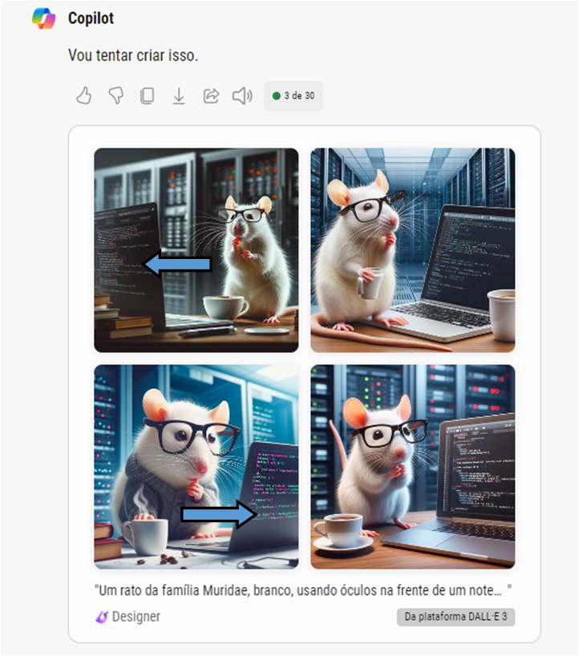

# Explorando a IA Generativa com o Microsoft Copilot e OpenAI: Um Tutorial Didático

**Introdução**

A inteligência artificial generativa (IA Generativa) é um campo em rápido crescimento que permite a criação de novos conteúdos a partir de dados existentes. Este tutorial irá guiá-lo através da exploração da IA Generativa usando o Microsoft Copilot e o OpenAI, com foco em:

* **Compreender os princípios básicos da IA Generativa**
* **Experimentar a geração de texto, imagens e código com o Copilot**
* **Explorar recursos avançados de IA Generativa com o Azure OpenAI**

<details>
<summary>Desvendando a IA Generativa com o Microsoft Copilot</summary>

O Microsoft Copilot é uma ferramenta poderosa que utiliza IA Generativa para auxiliar na pesquisa e na criação de conteúdo. Vamos explorar suas capacidades:

**1. Conectando-se ao Copilot:**
* Acesse copilot.microsoft.com e faça login com sua conta Microsoft.

 **2. Experimentação com prompts:**
* Na caixa "Pergunte-me qualquer coisa", digite prompts para gerar respostas sobre diversos tópicos.
* Utilize prompts específicos para obter resultados mais precisos e direcionados.
* Observe como o Copilot utiliza o contexto da conversa para gerar respostas relevantes.

 **3. Explorando recursos adicionais:**
* Experimente a geração de imagens com prompts descritivos.
* Utilize o Copilot para traduzir textos entre diferentes idiomas.
* Explore a funcionalidade de autocompletar código para otimizar sua produtividade.

</details>

<details>
<summary>Aventurando-se no Azure OpenAI</summary>

O Azure OpenAI oferece uma plataforma completa para desenvolvedores que desejam explorar a IA Generativa em seus projetos.

**1. Configurando seu ambiente:**
* Crie uma conta [Azure gratuita](https://azure.microsoft.com/free/).
* Solicite acesso ao serviço [Azure OpenAI](https://aka.ms/oaiapply).
  ***Recurso disponível apenas para e-mails comerciais, exemplo - username@dominio.com. Domínios públicos como Hotmail ou Gmail não se aplicam a regra*.**
* Crie um recurso Azure OpenAI no portal do Azure.

 **2. Implantando modelos de IA:**
* Implante modelos pré-treinados para gerar texto, imagens e código.
* Explore a biblioteca de modelos disponíveis no Azure OpenAI Studio.
* Personalize modelos para atender às suas necessidades específicas.

 **3. Experimentando o playground:**
* Utilize o playground do Azure OpenAI Studio para interagir com modelos de IA de forma interativa.
* Teste diferentes prompts e configurações para observar seus efeitos na geração de conteúdo.
* Explore a criação de scripts e workflows para automatizar tarefas com IA Generativa.

</details>

<details>
<summary>Considerações importantes</summary>

* **A IA Generativa ainda está em desenvolvimento e pode apresentar resultados inconsistentes.**
* **É importante ter cuidado ao usar prompts que podem gerar conteúdo prejudicial ou ofensivo.**
* **Explore os recursos de segurança e ética do Azure OpenAI para garantir o uso responsável da IA.**

</details>

<details>
<summary>Exemplos de Uso</summary>

**1. Prompt simples:**
**Prompt:** "fale de forma resumida com a atual teoria mais aceita a origem do universo"


**2. Gerando Códigos:**
**Prompt:** "crie uma estrutura básica de uma REST api em express js"


**JS File** - [/output/index.js](./output/index.js)

```js
const express = require('express');
const app = express();
app.use(express.json());

app.get('/', (req, res) => {
    res.send('Olá, Mundo!');
});

app.post('/api/items', (req, res) => {
    // Código para criar um item
});

app.get('/api/items', (req, res) => {
    // Código para obter itens
});

app.get('/api/items/:id', (req, res) => {
    // Código para obter um item específico
});

app.put('/api/items/:id', (req, res) => {
    // Código para atualizar um item específico
});

app.delete('/api/items/:id', (req, res) => {
    // Código para deletar um item específico
});

const port = process.env.PORT || 3000;
app.listen(port, () => console.log(`Servidor rodando na porta ${port}`));

```

**3. Prompt com o DALL E:**
**Prompt:** “crie uma imagem de um rato família Muridae, branco, usando um óculos na frente do notebook, pensando em como resolver um código descrito na tela do notebook. O cenário ao fundo e um escritório de TI “


* **Após a geração das imagens o próprio Copilot sugeriu esse prompt:
**Prompt:** "Faça o cenário ao fundo uma sala de servidores em vez de escritório."


**Nessa geração de imagens, em duas delas, errou na posição da tela do notebook**

* **Outra sugestão de prompt do Copilot:
**Prompt:** "Faça o rato segurando uma xícara de café. "



**Novamente, em duas imagens, errou na posição da tela do notebook**

</details>

</details>

<details>
<summary>Considerações Finais</summary>


Esse guia do LAB ofereçe uma introdução completa e prática à IA Generativa, capacitando os participantes a explorar as capacidades do Copilot e do Azure OpenAI. Através de uma combinação de teoria e prática, é fornecido as ferramentas e conhecimentos necessários para que os leitores iniciem sua jornada nesse campo em rápido crescimento.

**Benefícios:**
* **Aprendizagem prática:** Incentiva a experimentação com ferramentas reais, proporcionando uma experiência de aprendizado mais engajadora e eficaz.
* **Conteúdo abrangente:** Abrange desde os fundamentos da IA Generativa até recursos avançados, tornando-o ideal tanto para iniciantes quanto para usuários mais experientes.
* **Orientação clara:** Apresenta instruções passo a passo e dicas úteis, facilitando a compreensão e a aplicação dos conceitos.

**Recomendações:**
* Explorar a biblioteca de modelos disponíveis no Azure OpenAI Studio para descobrir novas aplicações da IA Generativa.
* Participar da comunidade do Azure OpenAI para interagir com outros desenvolvedores e especialistas em IA.
* Manter-se atualizado com as últimas novidades em IA Generativa através de blogs, artigos e eventos da área.

#### **Utilize essa tecnologia de forma criativa e responsável!**

</details>
